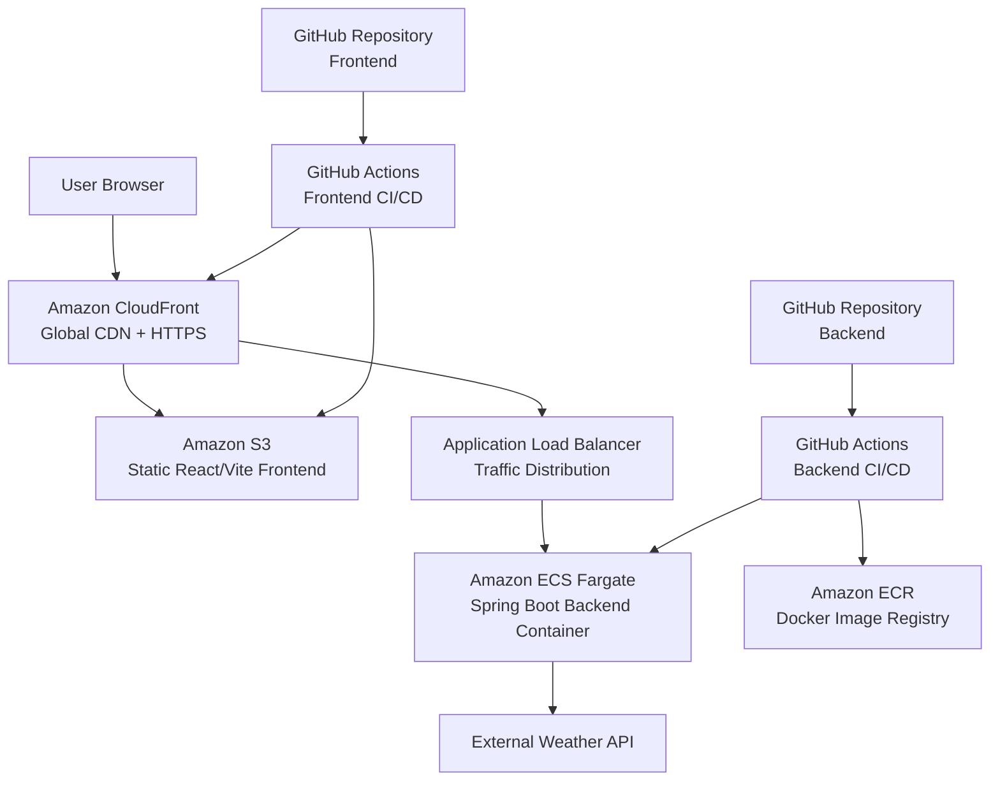

# aws-springboot-react-deployment

[English](#english-version) | [Español](#versión-en-español)
---

# 🇬🇧 English Version

## Table of Contents

- [Project Overview](#project-overview)
- [Why This Project Exists](#why-this-project-exists)
- [Architecture](#architecture)
- [Technology Stack](#technology-stack)
- [System Design Decisions](#system-design-decisions)
- [Backend Design](#backend-design)
- [Frontend Design](#frontend-design)
- [AWS Infrastructure](#aws-infrastructure)
- [CI/CD](#cicd)
- [Security Approach](#security-approach)
- [Local Development](#local-development)
- [Deployment Flow](#deployment-flow)
- [Future Improvements](#future-improvements)

## Project Overview

This project demonstrates how to design, deploy and automate a modern cloud-native application using a microservice-style architecture deployed entirely on AWS.

The objective of the project is not only to build a weather application, but to demonstrate real-world engineering practices such as:

- containerized backend services

- cloud infrastructure deployment

- global frontend delivery

- automated CI/CD pipelines

- secure authentication between GitHub and AWS

The application retrieves weather information from an external weather provider and exposes it through a simplified API consumed by a React frontend.

## Why this project exists
Every time my workpartners and I leave the office to get our break we do not know whether we will need an umbrella or not. Appareantely, this problem is resolved by Mobile Weather Applications but most of which contradicts between them so I thought It was an excellent excuse to create an application. Appart from solving our problem with the umbrella , this application has been created to enhance my cloud skills and my knowledge about automaticated deploys. 

## Architecture

### High-Level Architecture

## Technolgy Stack
The stack could be divided in many groups:
### BACKEND
- Spring Boot Java for BackEnd
- React Vite for FrontEnd
- GitHub for managing code (optional: GitLab...)
- IntelIj IDEA for IDE (optional: VS, Eclipse...)
### FROTNEND
- React
- TypeScript
- Vite
- Material UI
- Axios
- Recharts

### CLOUD
- AWS (click here to see this part)

### DevOps
- GitHub Actions
- OIDC federation
- Environment-based build configuration
---

### System Design Decisions

The application consumes the external API through the backend rather than directly from the frontend. This architectural decision allows the system to better manage and control the information provided by third-party endpoints. By introducing the backend as an intermediary layer, it becomes possible to implement security mechanisms, validate and transform external data, and expose only the necessary information to the frontend.

Spring Boot was selected as the backend framework because it enables rapid and structured development of RESTful services while simplifying integration with external APIs. It allows the application to consume third-party services and expose a clean internal API that can be securely and efficiently consumed by the frontend.

To handle the external API consumption, Spring WebFlux was used due to its reactive and non-blocking programming model. This approach improves scalability and performance when interacting with external services by allowing the system to manage multiple concurrent requests efficiently.

For the frontend, React was chosen because of its component-based architecture and mature ecosystem. It enables the development of modular and reusable user interface components and integrates well with modern tooling for building scalable applications that consume REST APIs.

# 🇪🇸 Versión en Español
(content)
